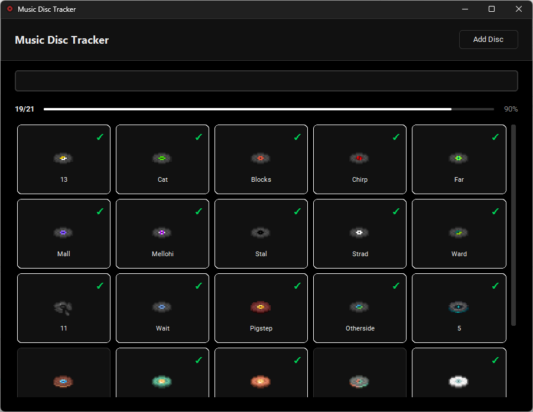

# Music Disc Tracker

A sleek, minimal desktop application for tracking your Minecraft music disc collection, featuring a modern Geist-inspired dark UI.


## Features

- **Collection Tracking** - Simple click-to-toggle ownership system
- **Smart Search** - Real-time filtering by disc name
- **Progress Insights** - Visual progress bar and stats
- **Custom Disc Support** - Add your own modded or custom discs
- **Safe Management** - Protects official discs while allowing deletion of custom ones
- **Rich Details** - Hover tooltips showing artist, description, and acquisition info
- **Persistent Data** - JSON-based local storage
- **Modern UI** - Clean, responsive, and beautiful dark mode interface

## Screenshots



## Installation

## Installation

### For Users (Release Version)
No Python installation required.

1. Go to the [Releases](https://github.com/Murqinistic-Tools/Minecraft-Disc-Tracker/releases) page.
2. Download the `MusicDiscTracker.zip` file.
3. Extract the ZIP file to a folder.
4. Open the folder and run `MusicDiscTracker.exe`.

### For Developers (Source Code)

#### Prerequisites
- [Python 3.10+](https://www.python.org/downloads/)
- Git

#### Setup
1. Clone the repository:
   ```bash
   git clone https://github.com/Murqinistic-Tools/Minecraft-Disc-Tracker.git
   cd Minecraft-Disc-Tracker
   ```

2. Run the setup script:
   
   **Windows:**
   Double-click `start.bat` (This creates venv, installs reqs, and runs the app)

   **Linux/macOS:**
   ```bash
   chmod +x start.sh
   ./start.sh
   ```

#### Manual Setup
```bash
# Create virtual environment
python -m venv venv

# Activate virtual environment
# Windows:
.\venv\Scripts\activate
# Linux/macOS:
source venv/bin/activate

# Install dependencies
pip install -r requirements.txt

# Run the application
python src/main.py
```

## User Guide

### Managing Discs
1. **Track**: Click any card to toggle between owned (Green border) and unowned (Grey border).
2. **Add Custom**: Click the "+" button in the header to add a new disc.
3. **Delete Custom**: Hover over a custom disc and click the small `×` in the top-left corner.
   - *Note: Official Mojang discs are protected and cannot be deleted from the UI.*

### Customization

#### Adding Images
You can add custom images for any disc (including your custom ones):
1. Navigate to the `data/disc-icons/` folder.
2. Place a PNG image named exactly after the disc ID (e.g., `my_custom_disc.png`).
3. Restart the application.

*Tip: Official disc images are included in the **Release Version**. If you are running from source code, you can download them from the [Minecraft Wiki](https://minecraft.wiki/w/Music_Disc) and place them in the `data/disc-icons` folder.*

## Project Structure

```
MusicDiscTracking/
├── src/                 # Source code
│   ├── models/          # Data structures
│   ├── repositories/    # Data persistence
│   ├── services/        # Business logic
│   ├── gui/             # UI components
│   └── main.py          # Application entry point
├── data/                # Data storage
│   ├── discs.json       # Disc database (pre-populated)
│   ├── collection.json  # User's owned discs
│   ├── app-icon/        # Application branding
│   └── disc-icons/      # Disc images (user populated)
├── start.bat            # One-click launcher for Windows
├── start.sh             # Launcher for Unix systems
├── requirements.txt     # Python dependencies
└── README.md
```

## Building Executable

To create a standalone `.exe` for Windows using PyInstaller in **Folder Mode** (Anti-Virus friendly):

1. Install build dependencies:
   ```bash
   pip install pyinstaller
   ```
2. Run the build script:
   ```bash
   python build.py
   ```
3. The executable folder will be in `dist/MusicDiscTracker/`. 

**Distribution Tip:** Zip the entire `MusicDiscTracker` folder and share the zip file. The user just needs to extract it and run `MusicDiscTracker.exe`.

## Contributing

Contributions are welcome! Please feel free to submit a Pull Request.

1. Fork the project
2. Create your feature branch (`git checkout -b feature/AmazingFeature`)
3. Commit your changes (`git commit -m 'Add some AmazingFeature'`)
4. Push to the branch (`git push origin feature/AmazingFeature`)
5. Open a Pull Request

## License

Distributed under the MIT License. See `LICENSE` for more information.

---
© 2025 Murqin
